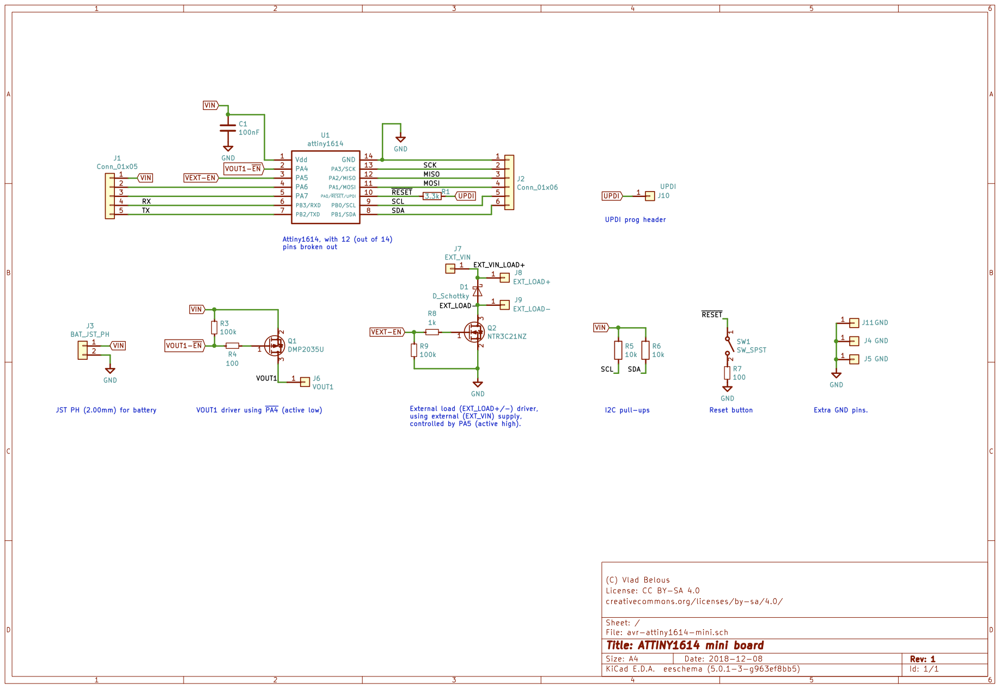
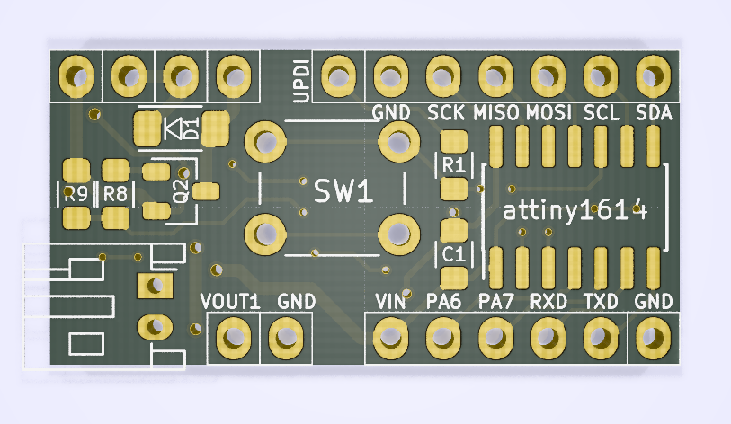

# AVR Attiny1614 (tinyAVR 1-Series) mini board

This is a simple breakout board for Attiny1614 MCU with a button and some pins dedicated to switching loads via MOSFETs.

Attiny1614 ([datasheet](http://ww1.microchip.com/downloads/en/DeviceDoc/ATtiny1614-data-sheet-40001995A.pdf)) is a new 8-bit AVR part from tinyAVR 1-Series.
In many important ways its architecture is much closer to atxmega rather than to (previous) attiny/atmega parts.
In fact, in avr-gcc it is categorized under avrxmega3 architecture.

This particular board has:
* Pin PA4 connected to high-side P-MOSFET for powering/driving an external component, using same VIN supply and common GND. This pin is **active low**.
* Pin PA5  connected to low-side N-MOSFET for driving a load using a separate supply (VEXT pin). Grounds levels will be separate. This pin is **active high**.
* Footprints for optional pull-up resistors for I2C.

This board has already been fabricated and tested to work.
It is available as a [shared project on OSHPark](https://oshpark.com/shared_projects/I7XN0JuT).

### Note on UPDI/~RESET pin:
Pin PA0 (UPDI/~RESET) can be used for either programming (via UPDI protocol) or RESET source functionality, but *you have to choose* between the two via a fuse setting. By default the fuse is setup for UPDI.

If you set the fuses for RESET source, programming the chip will require applying 12V, which is somewhat inconvenient.

Some workarounds:
* Keep the fuse in UPDI mode: you can still use the pin as digital input, and hence implement reset functionality in software (e.g. via interrupt, polling, etc). This is less reliable, since it assumes your MCU is in working state.
* Use/create a bootloader (I'm not aware of any existing yet for this part) that will allow you to program the chip via UART (similar to Arduino). Then you can change the fuse to enable it as RESET source.

Overall, this presents some inconvenience in scenarios when you need a reliable RESET.
This may be important in low voltage situations -- if your MCU gets stuck in some non-working state, a physical RESET signal is needed. Some mitigation is paying more attention to BOD (brown-out detection) settings.

### Development toolchain:
See https://github.com/vladbelous/tinyAVR_gcc_setup for details on how to setup a toolchain based on avr-gcc, avrdude and jtag2updi.

## Schematic:

## Layout (front):

